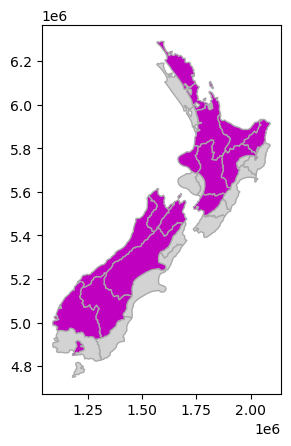
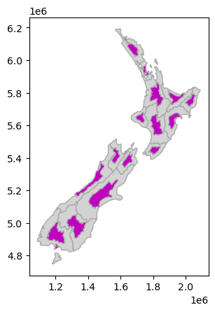
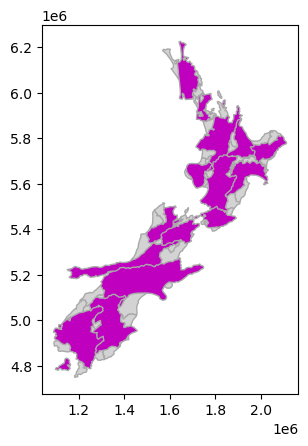

# Affined transformations

- shifting, rotations, scaling, transforming, etc.
- preserve lines and paralellism
- can change angles and lengths
- applied to GeoSeries, returns GeoSeries of transformed geometries

Requires a six-parameter list `[a,b,d,e,xoff,yoff]`

$$
x' = a x + b y + x_\mathrm{off}
\tag{4.1}
$$
$$ 
y' = d x + e y + y_\mathrm{off}
\tag{4.2}
$$

Simplified options exist:

    .translate(xoff=0.0, yoff=0.0)
    .scale(xfact=1.0, yfact=1.0, origin='center')
    .rotate(angle, origin='center', use_radians=False)


```python
import geopandas as gpd 
%matplotlib inline 
import matplotlib.pyplot as plt
from helpers import nz
```


```python
nz_shift = nz.translate(0, 100000)
```

> in addition to 'centroid', can use 'center' for the bounding box center, or an arbitrary point


```python
nz_scale = nz.scale(0.5, 0.5, origin='centroid')
```


```python
nz_rotate = nz.rotate(-30, origin='centroid')
```


```python
ax = nz.plot(color='lightgrey', ec='darkgrey')
nz_shift.plot(ax=ax, color='m', ec='darkgrey');
ax = nz.plot(color='lightgrey', ec='darkgrey')
nz_scale.plot(ax=ax, color='m', ec='darkgrey');
ax = nz.plot(color='lightgrey', ec='darkgrey')
nz_rotate.plot(ax=ax, color='m', ec='darkgrey');
```


    

    


    

    


    

    


```python

```
