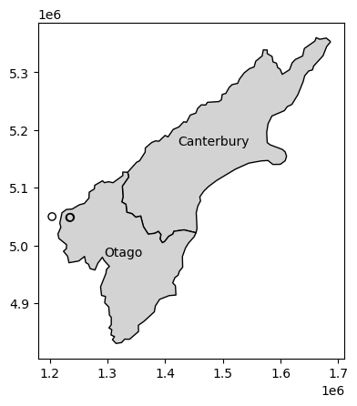

# Distance relations

>Distance is a continuous variable


```python
import geopandas as gpd 
from helpers import nz_height, canterbury, nz
%matplotlib inline 
import matplotlib.pyplot as plt 
```


```python
nz_highest = nz_height.sort_values(by='elevation', 
                     ascending=False).iloc[:3, :]
nz_highest
```


<div>
<style scoped>
    .dataframe tbody tr th:only-of-type {
        vertical-align: middle;
    }

    .dataframe tbody tr th {
        vertical-align: top;
    }

    .dataframe thead th {
        text-align: right;
    }
</style>
<table border="1" class="dataframe">
  <thead>
    <tr style="text-align: right;">
      <th></th>
      <th>t50_fid</th>
      <th>elevation</th>
      <th>geometry</th>
    </tr>
  </thead>
  <tbody>
    <tr>
      <th>64</th>
      <td>2372236</td>
      <td>3724</td>
      <td>POINT (1369317.63 5169132.284)</td>
    </tr>
    <tr>
      <th>63</th>
      <td>2372235</td>
      <td>3717</td>
      <td>POINT (1369512.866 5168235.616)</td>
    </tr>
    <tr>
      <th>67</th>
      <td>2372252</td>
      <td>3688</td>
      <td>POINT (1369381.942 5168761.875)</td>
    </tr>
  </tbody>
</table>
</div>


```python
canterbury.iloc[0]
```


    Name                                                    Canterbury
    Island                                                       South
    Land_area                                             44504.499091
    Population                                                612000.0
    Median_income                                                30100
    Sex_ratio                                                 0.975327
    geometry         MULTIPOLYGON (((1686901.9139 5353232.6602, 167...
    Name: 0, dtype: object


```python
canterbury_centroid = canterbury.centroid.iloc[0]
```

>Calculate the distance from each of the three elevation points


```python
nz_highest.distance(canterbury_centroid)
```


    64    115539.995747
    63    115390.248038
    67    115493.594066
    dtype: float64


>A distance matrix is a pairwise set of distances between all feature combinations


```python
sel = nz.Name.str.contains('Canter|Otag')
co = nz[sel]
co
```


<div>
<style scoped>
    .dataframe tbody tr th:only-of-type {
        vertical-align: middle;
    }

    .dataframe tbody tr th {
        vertical-align: top;
    }

    .dataframe thead th {
        text-align: right;
    }
</style>
<table border="1" class="dataframe">
  <thead>
    <tr style="text-align: right;">
      <th></th>
      <th>Name</th>
      <th>Island</th>
      <th>Land_area</th>
      <th>Population</th>
      <th>Median_income</th>
      <th>Sex_ratio</th>
      <th>geometry</th>
    </tr>
  </thead>
  <tbody>
    <tr>
      <th>10</th>
      <td>Canterbury</td>
      <td>South</td>
      <td>44504.499091</td>
      <td>612000.0</td>
      <td>30100</td>
      <td>0.975327</td>
      <td>MULTIPOLYGON (((1686901.914 5353232.66, 167999...</td>
    </tr>
    <tr>
      <th>11</th>
      <td>Otago</td>
      <td>South</td>
      <td>31186.309188</td>
      <td>224200.0</td>
      <td>26300</td>
      <td>0.951169</td>
      <td>MULTIPOLYGON (((1335204.789 5126878.25, 133695...</td>
    </tr>
  </tbody>
</table>
</div>


```python
d = nz_height.iloc[:3, :].apply(
    lambda x: co.distance(x.geometry), axis=1
)
d
```


<div>
<style scoped>
    .dataframe tbody tr th:only-of-type {
        vertical-align: middle;
    }

    .dataframe tbody tr th {
        vertical-align: top;
    }

    .dataframe thead th {
        text-align: right;
    }
</style>
<table border="1" class="dataframe">
  <thead>
    <tr style="text-align: right;">
      <th></th>
      <th>10</th>
      <th>11</th>
    </tr>
  </thead>
  <tbody>
    <tr>
      <th>0</th>
      <td>123537.158269</td>
      <td>15497.717252</td>
    </tr>
    <tr>
      <th>1</th>
      <td>94282.773074</td>
      <td>0.000000</td>
    </tr>
    <tr>
      <th>2</th>
      <td>93018.560814</td>
      <td>0.000000</td>
    </tr>
  </tbody>
</table>
</div>


```python
fig, ax = plt.subplots() 
co.plot(ax=ax, color='lightgrey', edgecolor='k')
co.apply(
    lambda x: ax.annotate(
        text=x.Name, 
        xy = x.geometry.centroid.coords[0], 
        ha='center'
    ), 
    axis=1
)
nz_height.iloc[:3,:].plot(ax=ax, color='none', edgecolor='k');
```


    

    


```python

```
