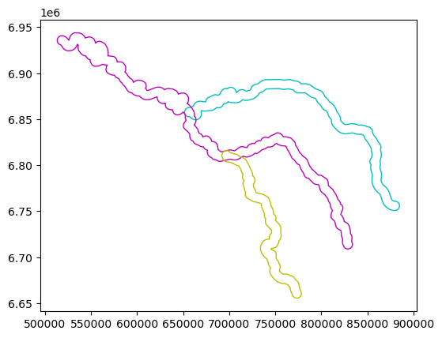
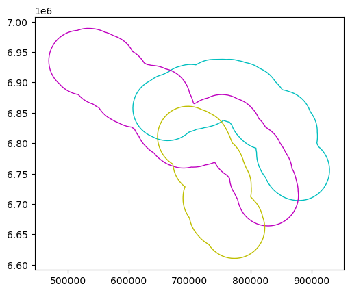

# Buffers

- returns a GeoSeries. To retain the attributes, make a copy of the original frame or add as new column


```python
import geopandas as gpd 
from helpers import seine
%matplotlib inline 
import matplotlib.pyplot as plt
```


```python
seine_buff_5km = seine.buffer(5000)
seine_buff_50km = seine.buffer(50000)
```


```python
seine_buff_5km.plot(color='none', ec=['c', 'm', 'y']);
seine_buff_50km.plot(color='none', ec=['c', 'm', 'y']);
```


    

    


    

    


```python
seine_buff_5km = seine.copy()
seine_buff_5km.geometry = seine.buffer(5000)
print(seine_buff_5km)
```

        name                                           geometry
    0  Marne  POLYGON ((657550.332 6852587.977, 657528.383 6...
    1  Seine  POLYGON ((517151.801 6930724.103, 516742.424 6...
    2  Yonne  POLYGON ((701519.74 6813075.492, 702765.277 68...


```python
seine['geometry_5k'] = seine.buffer(5000)
print(seine)
```

        name                                           geometry  \
    0  Marne  MULTILINESTRING ((879955.277 6755724.892, 8784...   
    1  Seine  MULTILINESTRING ((828893.615 6713872.817, 8282...   
    2  Yonne  MULTILINESTRING ((773482.137 6660431.284, 7713...   
    
                                             geometry_5k  
    0  POLYGON ((657550.332 6852587.977, 657528.383 6...  
    1  POLYGON ((517151.801 6930724.103, 516742.424 6...  
    2  POLYGON ((701519.74 6813075.492, 702765.277 68...  


```python
seine = seine.set_geometry('geometry_5k')
```


```python
seine = seine.set_geometry('geometry')
```


```python
seine = seine.drop('geometry_5k', axis=1)
```


```python

```
