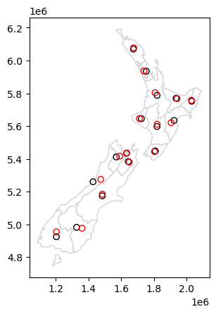
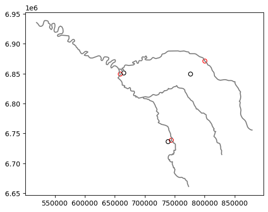

# Centroid

- estimate distances between polygons
- create simple point representations of complex geometries
- specify the location for text labels
- `representative_point` returns a point guaranteed to be on the geometry


```python
%matplotlib inline 
import matplotlib.pyplot as plt
from helpers import nz, seine
```


```python
nz_centroid = nz.centroid
seine_centroid = seine.centroid
```


```python
nz_pos = nz.representative_point()
seine_pos = seine.representative_point()
```


```python
ax = nz.plot(color='w', ec='lightgrey')
nz.centroid.plot(ax=ax, color='none', ec='k')
nz_pos.plot(ax=ax, color='none', ec='r'); 
ax = seine.plot(color='grey')
seine_pos.plot(ax=ax, color='none', ec='r')
seine_centroid.plot(ax=ax, color='none', ec='k');
```


    

    


    

    


```python

```
