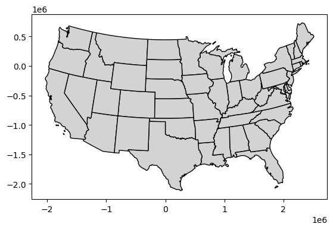

# Simplification of vector data

Reduce the number of nodes or vertices, with a tolerance parameter

For Polygons, topojson is preferred because it is boundary aware.


```python
import sys
import matplotlib.pyplot as plt
import geopandas as gpd
import topojson as tp
```


```python
from helpers import seine, us_states
```


```python
seine_simp = seine.simplify(2000)
seine.plot(); 
seine_simp.plot();
```


    

    


    

    


```python
sys.getsizeof(seine), sys.getsizeof(seine_simp)
```


    (350, 188)


```python
us_states9311 = us_states.to_crs(9311)
```


```python
us_states_simp1 = us_states9311.simplify(100000)
```


```python
topo = tp.Topology(us_states9311, prequantize=False)
us_states_simp2 = topo.toposimplify(100000).to_gdf()
```


```python
us_states9311.plot(color='lightgrey', edgecolor='black');
us_states_simp1.plot(color='lightgrey', edgecolor='black');
us_states_simp2.plot(color='lightgrey', edgecolor='black');
```


    

    


    

    


    

    


```python

```
