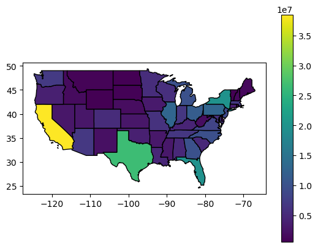
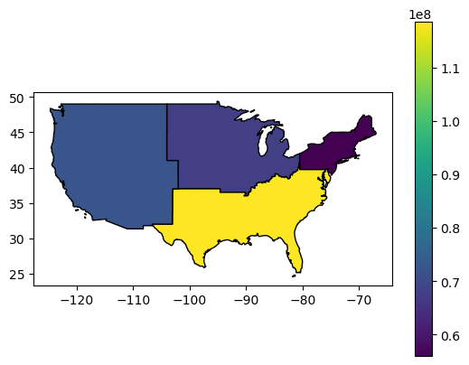

# Geometry Unions

- silently dissolves geometries of touching polygons in the same group using `union_all()` for each group

To combine two or more groups of a GeoDataFrame into one geometry, either:
- use a combined condition
- concatenate seperate subsets and then dissolve with `union_all()` 


```python
import geopandas as gpd
import pandas as pd
%matplotlib inline 
import matplotlib.pyplot as plt 
from helpers import us_states
```


```python
regions = (us_states[['REGION', 'geometry', 'total_pop_15']]
           .dissolve(by='REGION', 
                     aggfunc='sum').reset_index()
)
regions
```


<div>
<style scoped>
    .dataframe tbody tr th:only-of-type {
        vertical-align: middle;
    }

    .dataframe tbody tr th {
        vertical-align: top;
    }

    .dataframe thead th {
        text-align: right;
    }
</style>
<table border="1" class="dataframe">
  <thead>
    <tr style="text-align: right;">
      <th></th>
      <th>REGION</th>
      <th>geometry</th>
      <th>total_pop_15</th>
    </tr>
  </thead>
  <tbody>
    <tr>
      <th>0</th>
      <td>Midwest</td>
      <td>MULTIPOLYGON (((-89.10077 36.94397, -89.19948 ...</td>
      <td>67546398.0</td>
    </tr>
    <tr>
      <th>1</th>
      <td>Norteast</td>
      <td>MULTIPOLYGON (((-75.61724 39.83423, -75.7886 3...</td>
      <td>55989520.0</td>
    </tr>
    <tr>
      <th>2</th>
      <td>South</td>
      <td>MULTIPOLYGON (((-81.3855 30.27384, -81.25671 2...</td>
      <td>118575377.0</td>
    </tr>
    <tr>
      <th>3</th>
      <td>West</td>
      <td>MULTIPOLYGON (((-118.36998 32.83927, -118.4963...</td>
      <td>72264052.0</td>
    </tr>
  </tbody>
</table>
</div>


```python
ax = us_states.plot(ec='k', column='total_pop_15', 
              legend=True); 
ax = regions.plot(ec='k', column='total_pop_15', legend=True);
```


    

    


    

    


```python
us_west = us_states[us_states.REGION == 'West']
us_west_union = us_west.geometry.union_all() 
us_west_union
```


    

    


>Dissolve groups of a GeoDataFrame

>Approach 1


```python
sel = (us_states.REGION == 'West') | (us_states.NAME == 'Texas')
texas_union = us_states[sel]
texas_union = texas_union.geometry.union_all()
```

>Approach 2


```python
us_west = us_states[us_states.REGION == 'West']
texas = us_states[us_states.NAME == 'Texas']
texas_union = pd.concat([us_west, texas]).union_all()
```


```python
texas_union
```


    

    


```python

```
